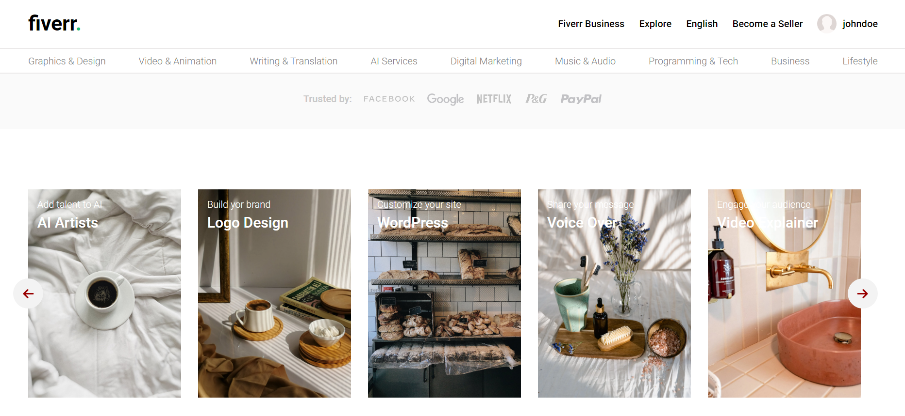
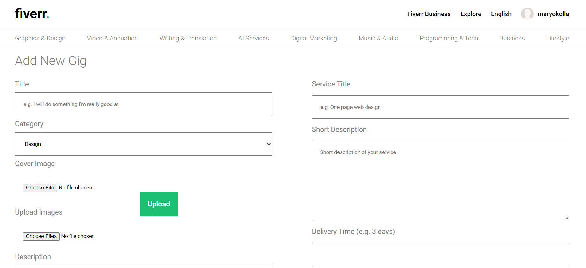

# Freelancing-Application-MERN
Freelancing application

# Freelance App

This full-stack MERN freelance job marketplace application offers a comprehensive solution for connecting freelancers with job opportunities. Built on the MERN stack (MongoDB, Express.js, React.js, Node.js), it combines the power of these technologies to deliver a robust and scalable platform.

A freelancing website serves as a digital marketplace where freelancers and clients connect for diverse project needs. It enables freelancers to highlight their expertise and bid on projects, while clients can post jobs, review candidates, and manage projects in one place. Key functionalities include user profiles, job boards, secure communication channels, and streamlined payment processing. This platform ensures efficient hiring, transparent collaboration, and timely project completion, benefiting both freelancers and clients through a trusted and flexible workspace.

## Technology

- JavaScript
- React
- Node
- Express
- MongoDB
- React Query
- SASS

## Views

  

  

## Setup

  Account:  `https://github.com/Prasadhprasadh/Freelancing-Application-MERN.git`
- Change directory into both client and server directories separately: `cd /client && cd /server`
- Install the required dependencies for both client and server: `npm install`
- Setup mongodb database and add url to `.env` file configuration
- Run both the applications simultaneously: client `npm run dev` and server `npm run dev`
- View the application on the browser using `http://localhost:5173`
